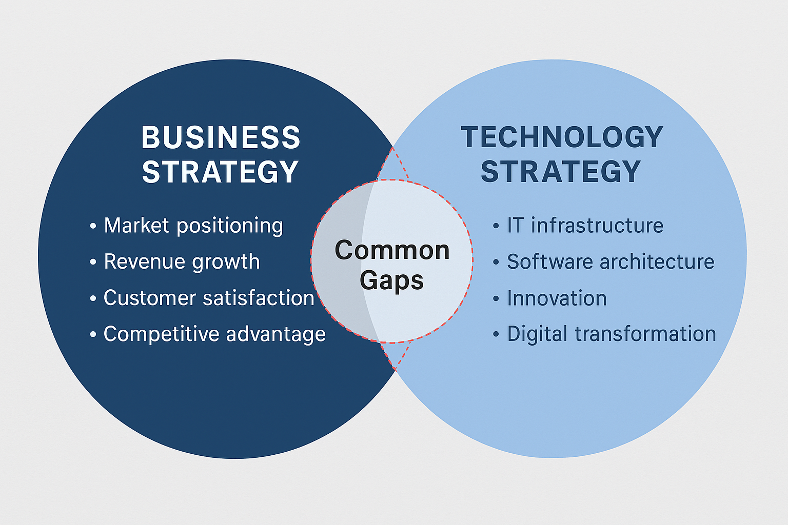

## Business Strategy vs. Technology Strategy
Business Strategy:

A business strategy defines the organization’s long-term goals and the plan to achieve them. 

Key Elements:
Vision and mission
Market analysis and customer needs
Revenue and profitability targets
Operational efficiency and cost control
Example:
“Expand into new markets and increase customer retention by 20% in the next fiscal year.”
Technology Strategy:

A technology strategy outlines how technology will support and enable the business strategy.

Key Elements:
Technology roadmap aligned with business priorities
Adoption of emerging technologies (cloud, AI, automation)
Governance and compliance frameworks
Example:
“Implement a cloud-native architecture to support global scalability and reduce infrastructure costs by 30%.”

Relationship Between the Two
Technology strategy is not independent; it should serve the business strategy.
Misalignment occurs when technology decisions are made without considering business goals, leading to wasted resources and missed opportunities