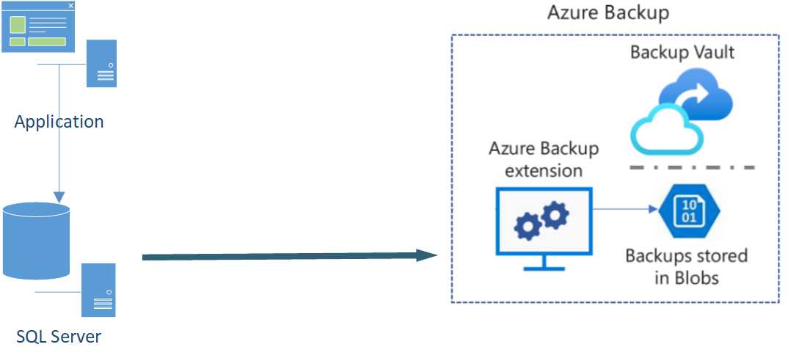

# Azure Backup

## 1. What is it?
A cloud-based service that provides backup and restore capabilities for Azure resources and on‑premises workloads.

## 2. Why do we need it?
Ensures data protection, disaster recovery, and compliance by securely storing backups in Azure Recovery Services vaults.

### Supported resources
- Azure VMs
- Azure Managed Disks
- Azure Files
- SQL Server in Azure VMs
- SAP HANA databases in Azure VMs
- Azure Database for PostgreSQL servers
- Azure Blobs
- Azure Database for PostgreSQL - Flexible servers
- Azure Database for MySQL - Flexible servers
- Azure Kubernetes cluster

## 3. Core Exam Focus
- Configure Recovery Services vaults
- Backup VMs, files, folders, SQL databases
- Restore operations (point-in-time, item-level)
- CLI/PowerShell tasks: `az backup vault`, `az backup protection`
- Common trap: forgetting to configure storage redundancy (LRS/GRS)

## 4. Real‑World Use Case
A multinational enterprise backs up mission‑critical VMs and SQL databases across multiple regions, ensuring compliance with data residency laws and enabling fast recovery from ransomware attacks.

## 5. Interview Lens
- Q: How would you design backup for a multi‑region workload?  
  A: Use Recovery Services vaults in each region, configure GRS for cross‑region redundancy, and automate policies with Azure Policy.  
- Q: What happens if a VM is deleted without backup enabled?  
  A: Data is lost permanently; enabling backup ensures restore points exist.  
- Q: How do you optimize backup costs?  
  A: Use differential backups, lifecycle policies, and archive tier for long‑term retention.

## 6. Common Mistakes
- Not enabling backup before VM deletion
- Misconfigured retention policies
- Overlooking storage redundancy settings
- Assuming backups are automatically geo‑replicated

## 7. Mental Model
Think of Azure Backup as a **“time machine vault”** — every snapshot is a checkpoint you can roll back to, stored securely in a vault.

## 8. Revision Summary
- Azure Backup = cloud‑based data protection  
- Recovery Services vault = central backup container  
- Supports VMs, files, folders, SQL workloads  
- Retention policies + redundancy critical  
- CLI/PowerShell tasks often tested  
- Watch out for storage redundancy & retention misconfigs
