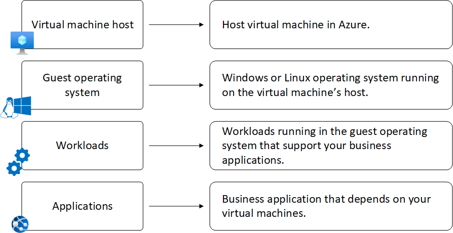

# VM Monitoring Layers

## 1. What is it?
A tiered monitoring stack that captures telemetry from the **host infrastructure**, **guest operating system**, **client workloads**, and **applications** running inside the VM.

## 2. Why do we need it?
Provides end‑to‑end visibility across all layers — from hypervisor health to application performance — ensuring proactive detection, compliance, and optimized resource usage.

## 3. Core Exam Focus
- Host metrics (CPU, memory, disk, network from Azure fabric)
- Guest OS diagnostics (boot logs, syslog, Windows event logs)
- Workload monitoring (SQL, IIS, Apache, custom services)
- Application insights (APM, distributed tracing)
- Common trap: enabling only host metrics → blind to guest/application issues

## 4. Real‑World Use Case
A financial services firm runs trading workloads on Azure VMs.  
- Host monitoring ensures VM availability across regions.  
- Guest OS monitoring tracks patch compliance.  
- Workload monitoring validates SQL transaction throughput.  
- Application monitoring traces latency in trading APIs.  
Together, this layered approach supports regulatory audits and SLA guarantees.

## 5. Interview Lens
- Q: How do you differentiate host vs guest monitoring?
  - A: Host = Azure fabric metrics; Guest = inside‑VM OS logs/events.
- Q: What’s the risk of ignoring application monitoring?
  - A: Infrastructure may look healthy, but user experience can degrade unnoticed.
- Q: How would you unify monitoring across hybrid VMs?
  - A: Use Azure Arc to onboard on‑prem VMs into Azure Monitor + Log Analytics.

## 6. Common Mistakes
- Assuming host metrics alone are sufficient
- Not enabling guest diagnostics → missing OS/application visibility
- Over‑collecting logs without retention planning → cost overruns
- Ignoring workload‑specific extensions (SQL, SAP, etc.)

## 7. Mental Model
Think of VM monitoring like a **layered medical exam**:
- Host VM = vital signs (pulse, BP)
  - VM availability
  - CPU usage percentage (average)
  - OS disk usage (total)
  - Network operations (total)
  - Disk operations per second (average)
  
- Guest OS = internal organs check (blood tests)
- Client workloads = specialized diagnostics (cardiology, neurology)
- Applications = patient’s daily performance (fitness/activity tracker)

## 8. Revision Summary
- Host metrics = Azure fabric health
- Guest OS = boot/event/syslog visibility
- Workloads = service‑level monitoring (SQL, IIS, etc.)
- Applications = APM + tracing
- Azure Monitor + Log Analytics unify all layers
- Hybrid VMs onboarded via Azure Arc
