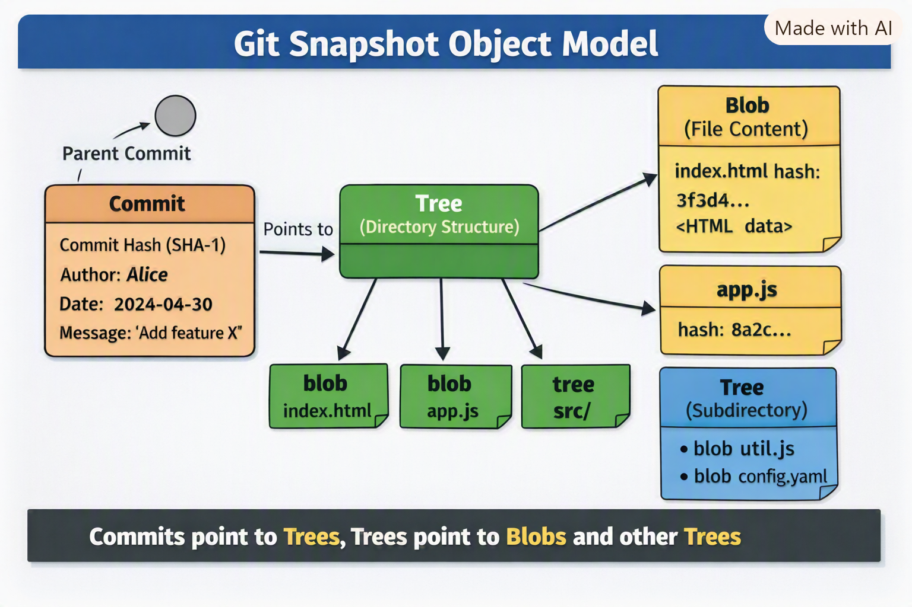

# 🔎 How Git Manages Snapshots Internally
## 1. Snapshot vs. Diff Model
Traditional VCS (SVN, CVS): Store changes as deltas (patches) applied sequentially. Retrieving a version requires reconstructing from multiple diffs.

**Git:** Stores a full snapshot of the project at each commit. If a file hasn’t changed, Git simply points to the existing object instead of duplicating it. This makes version retrieval constant‑time.

## 2. Git Object Types
- Git’s snapshot system is built on four object types:
- Blob: Stores file content.
- Tree: Represents directory structure (points to blobs and other trees).
- Commit: A snapshot reference + metadata (author, timestamp, parent commit).
- Tag: A human-readable reference to a commit.

Each object is identified by a SHA‑1 hash (content‑addressable storage). This ensures integrity and allows deduplication.

## 3. Workflow States
Git tracks files in three states:
- Modified (Working Directory): Files you edit locally.
- Staged (Index): Files marked for inclusion in the next snapshot.
- Committed (Repository): Snapshot saved permanently in Git’s object database.

## 4. Efficiency
- Storage: Unchanged files are referenced, not duplicated.
- Performance: Retrieving any commit is direct — Git loads the snapshot without reconstructing diffs.
- Integrity: Every object is hashed, ensuring corruption is detectable.

## 📌 Real‑World Analogy
- Think of Git as a camera:
- Each commit = a photo of your project folder.
- If nothing changed in a file, Git reuses the same “photo” of that file from earlier.
- Switching branches or reverting commits is like flipping through an album of snapshots.

## 🎯 Exam Perspective
- Be able to explain snapshot vs. diff model.
- Know Git’s object types and how commits reference trees/blobs.
- Understand content‑addressable storage and SHA‑1 hashing.
- Be ready to discuss why Git is faster than delta‑based systems.

## 💡 Interview Q&A
Q: How does Git store history differently from SVN?
A: SVN stores diffs; Git stores complete snapshots with references to unchanged files.

Q: What ensures Git’s data integrity?
A: SHA‑1 hashes for every object.

Q: Why is Git fast at branching?
A: Branches are just pointers to commits (snapshots), not separate file copies.

## ⚠️ Common Mistakes
- Thinking Git stores only diffs (it doesn’t).
- Assuming commits duplicate all files (unchanged files are referenced).
- Forgetting that staging area is part of snapshot creation.

## 🧠 Mental Model
Visualize Git as a graph of snapshots:
- Nodes = commits (snapshots).
- Edges = parent relationships.
- Branches = pointers to specific snapshots.

## 📘 Revision Summary
- Git stores snapshots, not diffs.
- Objects: blob, tree, commit, tag.
- SHA‑1 hashes ensure integrity.
- Retrieval is constant‑time since snapshots are complete.
- Branching/merging is efficient because commits are just references.

## Diagrammatic view of Git’s snapshot object model

## 🖼️ How to Read This Diagram
- Commit object (orange): Contains metadata (author, date, message) and points to a Tree.
- Tree object (green): Represents the directory structure. It points to blobs (files) and other trees (subdirectories).
- Blob object (yellow): Stores the actual file content. Each blob is identified by a SHA‑1 hash.
- Parent commit (gray circle): Links commits together, forming the history graph.
## Key Idea
Commits → Trees → Blobs/Subtrees
- Every commit is a snapshot of the repository at that point in time.
- Unchanged files are referenced by their existing blob hash, so Git avoids duplication.

## 🔑 Mental Model Reinforcement
- Think of Git as a graph of snapshots:
- Commits are nodes.
- Trees are the structure.
- Blobs are the content.
- Branches are just pointers to commits.

This is why Git can switch branches or roll back instantly — it’s just moving pointers between snapshots.