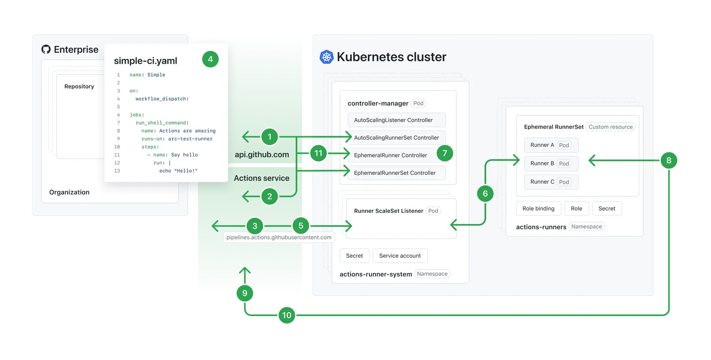

# Runner Scale Set

## 1. What is it?
- A **runner scale set** is a group of **self-hosted runners** managed together in Azure or other environments.
- It allows **automatic scaling** of runners based on workload demand.
- Useful for organizations needing **elastic capacity** for CI/CD pipelines.



## 2. Why do we need it?
- Standard runners may not handle enterprise workloads efficiently.
- Scale sets provide:
  - **Dynamic scaling** (add/remove runners automatically).
  - **Centralized management**.
  - **Cost optimization** by running only when needed.
- Ensures pipelines don’t fail due to lack of available runners.

## 3. Real World Example
```yaml
jobs:
  build:
    runs-on: scale-set:myRunnerSet
    steps:
      - uses: actions/checkout@v3
      - run: npm install && npm test
```
- runs-on: scale-set:myRunnerSet → job uses a runner from the defined scale set.
- Azure VM scale sets can automatically provision new runners when demand spikes.

## 4. Exam Perspective
Key focus areas:
- Difference between single self-hosted runner vs runner scale set.
- Benefits: scalability, elasticity, cost control.
- Configuration in workflow YAML (runs-on keyword).
- Expect questions on when to use scale sets (large orgs, variable workloads).

## 5. Interview Questions and Answers
Q: What is a runner scale set?
A: A group of self-hosted runners managed together, with automatic scaling to handle workload demand.

Q: Why use runner scale sets over individual runners?
A: Scale sets provide elasticity, centralized management, and cost efficiency.

Q: How do you configure a workflow to use a runner scale set?
A: Use runs-on: scale-set:<name> in the workflow YAML.

## 6. Common Mistakes
- Misconfiguring runs-on → jobs fail to find runners.
- Not setting proper scaling rules → under/over-provisioning.
- Forgetting authentication/permissions for Azure scale sets.
- Using scale sets unnecessarily for small projects → wasted resources.

## 7. Mental Model
- Think of runner scale sets as “cloud-based worker pools”:
- Single runner = one worker.
- Scale set = a flexible team that grows/shrinks based on workload.
- Ensures jobs always have available workers without manual intervention.

## 8. Revision Summary
- Runner scale set = scalable group of self-hosted runners.
- Benefits: elasticity, centralized management, cost efficiency.
- Configured with runs-on: scale-set:<name>.
- Best for enterprise workloads with variable demand.

